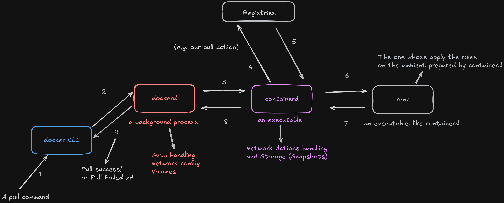
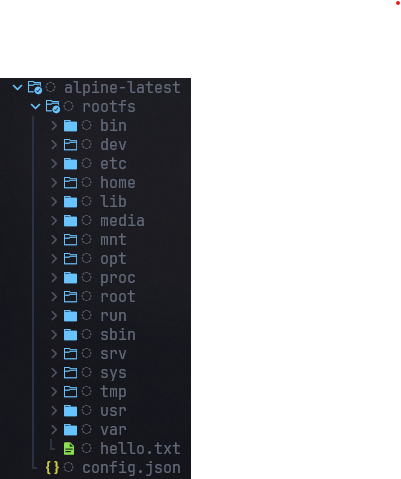

> _Essentially Linux ones_

Ever since I have been involved with programming I have heard a lot about _Containers_, how _important_, _handy_, _efficient_ they are;
How important they are to the CI/CD workflow and the health/development cycle of an application, etc...
But they also has always been a big question-mark to me: I could never explain consistently _**what they really are**_.

I have heard they are boxes, but _Why_ we need them? _What_ they are made of? _How_ are they made? _Where_ are they built? _Why_ they need a Linux environment in order to work? To answer these questions is my ultimate goal with this article. So we begin:

## Why

The core idea of _containerization_ specially on the _software quality matter_ came with the specific issues of _environment disparity_, also known as the 'but on my machine is working!' problem.

To _Containerize_ something means to use Kernel environment-specific tools, even if they the tool is a wrapper around these Kernel-tools, in order to create new environments with a specific fine-grained setup; What includes control over **CPU**, **Memory**, **Permissions**, **Network**, **File System** among others.
This way we automatically get a 'work-on-all-linux-environments' box which has control of some important behaviors of our application.

This box (following the Open-Container Initiative) is essentially a _**pack of folders**_ with a config.json file (more on that later), which generally comes in a GZip/Tar encoded format (.tar.gz), which is organized and runned by a _**runtime**_ like _**Docker**_. Which is the next matter we will be focusing on.

### Runtimes

A runtime is the program which gets our box, also known as an _**Image**_, unpacks it and executes the required actions. But what are these 'actions'?
They are essentially all the runtime can perform in order to correctly setup all the environment, but you must be wondering to yourself: How the container knows _what_ need to be done? And I answer you: Bundle Files.

#### Bundle Files

These files act like a _receipt_ to the runtime. This receipts follow a pattern known as OCI, from the Open-Container Initiative. It looks like this:

```json
{
  "ociVersion": "1.0.2-dev",
  "root": {
    "path": "/home/user/target-folder/alpine-latest/rootfs",
    "readonly": false
  },
  "mounts": [
    {
      "destination": "/proc",
      "type": "proc",
      "source": "proc"
    },
    {
      "destination": "/dev",
      "type": "tmpfs",
      "source": "tmpfs",
      "options": [
        "nosuid",
        "strictatime",
        "mode=755",
        "size=65536k"
      ]
    },
  ],
  "process": {
    "args": [
      "/bin/sh"
    ],
    "env": [
      "PATH=/usr/local/sbin:/usr/local/bin:/usr/sbin:/usr/bin:/sbin:/bin"
    ],
    "capabilities": {
      "bounding": [
        "CAP_AUDIT_WRITE",
        "CAP_NET_BIND_SERVICE",
        "CAP_KILL"
      ],
    },
  },
  "hostname": "alpine-latest",
  "linux": {
    "namespaces": [
      {
        "type": "pid"
      },
      {
        "type": "cgroup"
      }
    ],
  }
}

```

The file is way bigger, because of that I cut several parts of it. The Bundle File is just a .json file which is created on the Client to obtain the layers of the image. It dictates the rules and actions the Runtime _must_ follow in order to set the container up. But hold up. Which Client? Well, it happens that a runtime like Docker **is not a single thing**, it consists of several moving parts. The Docker we interact with is the **Docker CLI**, basically the _Front-End_, the **Client** of all operations.

The one who does the heavy-work is (by default) **dockerd**. **dockerd** is a _Daemon_, a background continuous process which communicates with the client, which for itself uses the real runtime: **containerd** a executable which itself uses other executable, **runc**.
You can even verify it's existences running ```which dockerd``` and ```which runc``` on your Docker-enabled env. Wow... But I want to keep this article scope not too deep into these internal implementation details, instead, I want to show you the big picture of what is really happening, which is pretty simple on reality:



One pretty thing about Containers is that they do not necessarily need internet connection in order to run, what makes it suitable to be runned on a lot of different situations, and as all the _Containers_ runs essentially on Linux environments, we can simply execute this image on _**every**_ compatible Kernel environment with the Image's target architecture.

## What

Ok, control over the environment, _Bundle Files_, _Clients_, _Runtimes_, _Daemons_👹... That's cool, but we still haven't seen the _real_ face, the one which is really isolated, the piece that the runtime construct the environment around it... And here is it:



This is the mount point of the environment, where the Runtime will create the environment. It happens that this environment we've been talking a while is just a _Process_, yep, that's what ```docker ps``` shows something running. And here is the catch: The Runtime isolates a specific _Process_ which is mounted on the top of this rootfs folder, our _Image_.

This Process is fooled to think that the environment the runtime created to it is the _real_ environment; The runtime puts the Process on a blind state, mounting the rootfs and isolating the rest of the computer to it, so it just sees the 'rootfs folder'.

If you are a good observer you will notice that there is also a config.json file present on the folder, aside of rootfs. This file is another specification to the runtime, but is mainly has these four specs:

```json
{
  "Cmd": [
    "/bin/sh"
  ],
  "Entrypoint": null,
  "Env": [
    "PATH=/usr/local/sbin:/usr/local/bin:/usr/sbin:/usr/bin:/sbin:/bin"
  ],
  "WorkingDir": "/"
}
```

Here is valid to explain some fields:

- Cmd: The default argument passed to Entrypoint.
- Entrypoint: The path of an executable or binary (like the NGINX one!).
- Env: Key/Value pairs loaded into the Environment.
- WorkingDir: Where the 'cwd' will be.

// TODO complete argument

This way is easy to visualize how the runtime handles the start action of the container, nice (!!)

## The How

Now it's time to understand the mechanisms the Kernel offers to us in order to deal with this isolation as well as how they are used.
Every tool used to isolate an environment is a corollary of some tool the Kernel already expose to us. To _isolate_ means use a broad number of them in order to bind the Container Process. Let's see examples of them:

### Namespaces

Namespaces are options you can pass to a ```fn clone() -> PID``` syscall (creates a new process, our Container in this case) which modifies the shape of that final process the Kernel will create for us. No need to worry about this syscall, it is pretty much it: If you don't pass any flags, the cloned process will be exactly as the same as the proccess which spawned it, simple as that. Some flags include:

- NEWNS: A isolated mount point. Basically a detaches the parent process filesystem from the cloned one.
- NEWUTS: A new hostname.
- NEWIPC: A new IPC channel.
- NEWPID: A new complete process PID.
- NEWUSER: A new Hostname.
- NEWCGROUP: A CGroup cluster.
- NEWNET: A Isolated Network.

They can be seen on the Bundle specification:

```json
  "linux": {
    "namespaces": [
      {
        "type": "pid"
      },
      {
        "type": "cgroup"
      }
    ],
  }
```

This tells which flags the runtime should include on the _clone()_ call action.
While Namespaces provides the isolation (what I can see), CGroups provides the how much can I use, which is what we are about to see.

### Control Groups

'CGroups' is a huge matter which is worth its own article; But the general idea is that 'CGroups' is the convention the Linux Kernel uses in order organize/manage how much of the computer (%) a process and it's childs can use as well as some metrics information; It has two flavors: _v1_, and _v2_ which is the one I will be focusing on.

Following the philosophy of Linux where 'all is a file', CGroups is an hierarchy of folders _and files_ which can be rougly found on ```/sys/fs/cgroup/docker/container-alpha/``` for example. Each process receives it's own 'tree' of CGroups, but still keep itself inside the global CGroup tree, the _v2_ specially is a more ergonomic solution, once its organization it superior compared to _v1_. Without CGroups, one container could consume all the RAM on a host and crash other containers (the "noisy neighbor" problem).

CGroups stays as home-work for search **:^)**. Next: Capabilities.

### Capabilites and (Seccomp)

Capabilities is what the process is allowed to do, it includes open a network port inside the process, modify a file, delegate permissions to other users, etc... They spec look like this:

```json
"capabilities": {
      "bounding": [
        "CAP_AUDIT_WRITE",
        "CAP_NET_BIND_SERVICE",
        "CAP_KILL"
      ],
    }
```

Here, we create a definition which says: this process can write, bind to a network service and kill a process. Capabilities basically breaks the previous idea of "all-or-nothing", where the process could be either a Root or a Rootless one.
The 'bounding' specification is one of all the ones capabilities can have; 'bounding' acts like a ceiling, where the processes permission can never go beyond what is defined in it, even if an executable demands it.

### Networking

- Network Options

###

## The Where

## Things Containers Can Do

## Container Managers

// Compose / Kubernetes
