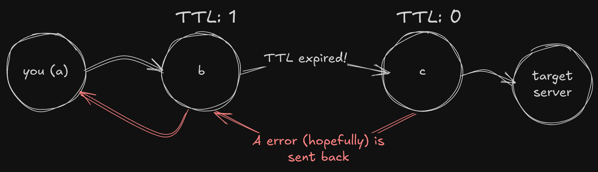

In this tutorial, we’re going to make an CLI Tracerouter which uses a ICMP packet request approach, since the Raw Socket creation until the entire trace itself, what gives us a great vision of how requests are made and sent over the Internet, as well as we crafting our own Checksum function! Don’t get too hung up on these terms right now, the article is made to instruct first-way people who are interested in understanding the Internet deeper as well as the experienced ones.

<aside>
💡

NOTE: The title doesn’t specify a language, the tutorial is written in Rust but it’s focus in on concepts, what makes it’s content suitable to be written in basically any language programming of your choice with sockets support !!

</aside>

## But, what is a Socket?

A Socket is a specific structure — basically a pattern, which interface with the computer network hardware API itself *(This API is OS specific, but in our case, socket2 crate handle this for us)*; What means when we make any kind of request we are using Sockets in some way, which handles a lot of things for us. In this tutorial we’re going to use them to make our Tracerouter using ICMP request but specifically using *Raw Sockets*, which are a even low-level kind of Socket; It is like a *Primitive Socket* that allow we to craft our own packets !!

## What about ICMP? Why?

ICMP is another packet type like UDP or TCP and stands for Internet Control Message Protocol which offer us a standard way to inform network status/errors over the Internet, what is a lot handy once we want to discover the network until our target server.

The Internet acts like a large graph of routers! where each router forward the request to the next until our target server is reached; In this tutorial specifically we’re going to explore the layer 3 and 4 of the Internet whose are respectively the internet and the transport layers conventionally; This way the Internet works allow us to probe our network by sending specific packets (ICMP’s in our case) by testing them by try-error.

The ICMP choice isn’t random, we can probe our network by manipulating the IP Header TTL property and get a error report back to us. This property tell to routers the lifetime of the packet, when TTL 0 is reach that means the packet is invalid, and a error message are hopefully sent back to us:



<aside>
💡

NOTE: Hopefully in this case is because as we are dealing with strange routers, some of them can behavior different from what we expect; Like returning nothing when TTL reach 0, so it is interesting to test with many different target addresses to check they behavior.

</aside>

Talking deeper about TTL, it is specified on the IP header, which is the layer responsible to find our target server across the Internet. The TTL count is decreased in every router it hops and is send further to the next router; When TTL reach 0 the packet is expired, them we use the error returned to get information about the network making the calls successively each one increasing the TTL count by one.

.](image%201.png)

Image from Berkeley’s University CS168: [https://sp25.cs168.io/](https://sp25.cs168.io/).

## How we are going to make it exactly?

Our Tracerouter will take advantage of how TTL works and will probe the IP’s sending various waves of TTL increasing progressivelly they count until we find our target server; First we need a Socket, in our case we’re going to use a special type of Socket as mentioned earlier, a *Raw Socket; After, we’re going to craft our own IP and ICMP headers! IP acts like a wrapper around the ICMP header, and once the IP layer find our target, the header are parsed and removed, this way:*


## Tools used in the tutorial

[Language]

Rust

[Crates]

local-ip-address —> Util which takes local IP dynamically.

dns-lookup —> Resolve CLI given domain name.

socket2 —> Network Socket API.

## Setting up our Environment

In this tutorial, we’re going to use the socket2 crate which gives us a lot of utils when leading with sockets and raw protocols. But first, we create our project:

```bash
> cargo new tracerouter
> cd tracerouter
```

Next, when specify the socket2 crate in our Cargo.toml:

```toml
[dependencies]
socket2 = "0.5"
```

And create a tracerouter folder with it’s mod.rs file where we’ll store our logic to be called in main.rs so the workspace should be like:


<aside>
💡

NOTE: When running the project, as we are dealing with a low-level abstraction of Sockets, root privilege should be granted to the process so it can run properly.

</aside>

And now our project are good to start.

## Parsing IPs

Before we create our Socket, our CLI first need to be able to accept line arguments as well as resolve domains using a DNS so we can use human-readable string (like [google.com](http://google.com/) instead of 8.8.8.8) so we’re going to make this checking and validating arguments and using the dns-lookup crate:

```rust
[main.rs]

use std::env;

fn main() -> std::io::Result<()> {
    let args: Vec<String> = env::args().collect();
    if args.len() != 2 || args[1].is_empty() {
        eprintln!("Usage: tracerouter <hostname>");
        std::process::exit(1);
    }
    println!("Tracing route to: {}...", &args[1];);
}
```

This code reads the executable arguments and check if the hostname argument is present in program call, if not, it prints an error and finish the program process; 

After that, we set a util function to resolve our hostname into it’s IPV4 address using the dns_lookup crate in *mod.rs*:

```rust
[mod.rs]

use std::net::IpAddr;
use dns_lookup::lookup_host;

/// Lookup host and return a list of valid IPV4-only addresses.
/// 
pub fn resolve_host(hostname: &String) -> Vec<IpAddr> {
    match lookup_host(hostname) {
        Ok(ips) => {
            ips
            .into_iter()
            .filter(|ip| ip.is_ipv4() )
            .collect::<Vec<IpAddr>>()
        }
        Err(e) => {
            eprintln!("Could not find valid IPs for {hostname}, {e}");
            std::process::exit(1);
        }
    }
}
```

This code take our hostname and search for it’s IPs and exits when no valid IPV4 address is found. Here, we just looked up into a very important network concept: Domain Name Servers which are servers present all over the Internet which gives us the correctIP representation given a hostname.

Now we call the function:

```rust
[main.rs] After route println! feedback

[...]
use tracerouter::resolve_host;

fn main() -> std::io::Result<()> {
[...]
    println!("Tracing route to: {}...", &args[1]);
    
    let ips = resolve_host(&args[1]);
    if ips.len() == 0 {
        eprintln!("Error: Could not find IP for {}", &args[1]);
        std::process::exit(1);
    }
    
    Ok(())
}
```

## Creating our own Socket

Now, in order to finally create our Socket we’re going to initialize it’s structure and specifying we are setting the IP Header manually without passing throught system network-layer processing:

```rust
[main.rs]

use socket2::{Domain, Protocol, Socket, Type};

fn main() -> std::io::Result<()> {
[...]	
    // Create our IPV4 Socket
    let socket = Socket::new(
        Domain::IPV4,
        Type::RAW,
        Some(Protocol::ICMPV4)
    ).expect("Error: Could not initialize Socket.
    It is required for program to be running in a high privilege state.");   
    
    // Specify to kernel we're sending our own IP header
    // If false, system will take care of it
    socket.set_header_included_v4(true).expect("Could not specify IP_HDRINCL header.");

    Ok(())
}
```

This creates our Socket and specify which protocol we’re going to use (ICMPV4 for ICMP requests using IPV4).

Next, we need to craft the IP and ICMP headers as our project will work with 3 different structures:

**IP Header** (20 bytes without options):
• Contains fields like version, length, protocol, source/destination IPs, and a checksum.

**ICMP Header** (8 bytes for an Echo Request):
• Includes type, code, checksum, identifier, and sequence number.

**Data** (optional): We’ll omit this for simplicity, making the total packet size 20 + 8 = 28 bytes.

### The IP Header Structure

The IP Packet is also a convention as well as ICMP (as well as all Protocols) so we need to follow the pattern below so our IP Header get correctly interpreted by the destination:

| **Offset (Bytes)** | **Field** | **Size** | **Value** | **Description** |
| --- | --- | --- | --- | --- |
| 0 | Version + IHL | 1 byte | 0x45 | Version 4 (4 bits), IHL 5 (4 bits, 5*4=20 bytes) |
| 1 | Type of Service (ToS) | 1 byte | 0 | Default QoS (0) |
| 2-3 | Total Length | 2 bytes | 28 | IP header (20) + ICMP header (8), big-endian |
| 4-5 | Identification | 2 bytes | 0 | Unique packet ID (0 for simplicity) |
| 6-7 | Flags + Fragment Offset | 2 bytes | 0 | No fragmentation (0) |
| 8 | Time to Live (TTL) | 1 byte | 64 | Hop limit |
| 9 | Protocol | 1 byte | 1 | ICMP protocol number |
| 10-11 | Header Checksum | 2 bytes | (Calculated) | Checksum over IP header, big-endian |
| 12-15 | Source IP Address | 4 bytes | e.g., 192.168.1.100 | Source IP in byte form |
| 16-19 | Destination IP Address | 4 bytes | e.g., 8.8.8.8 | Destination IP in byte form |

To craft our own IP Header object we’re going to write manually the bits to it using Buffers, which are nothing more than arrays of bytes and as our IP Header are 20 bytes long, we’re going to make it this way:

```rust {hl_lines=[18]}
[main.rs]

fn main() -> std::io::Result<()> {
[...]
    let mut packet = [0u8; 20 + 8]; // IP Header (20 bytes) + ICMP (8 bytes)

    // IP Header (simplified, version 4, no options)
    // First 4 bits are the version (4) and the preceding 4 bits IHL (5) (big-endian represented)
    packet[0] = 0x45;                        // Version: 4, IHL: 5
    // packet[1] = 0;                        // ToS omitted because bucket is already 0
    packet[2] = 0;                          // High Byte
    packet[3] = 28;                         // Low Byte
    packet[4..6].copy_from_slice(&0u16.to_be_bytes()); // Identification (0)
    packet[6..8].copy_from_slice(&0u16.to_be_bytes()); // Flags + Fragment Offset (0 unspecified)
    // packet[8] = 4;                       // TTL (Late populated)
    packet[9] = 1;                          // Protocol (ICMP)
    
    Ok(())
}
```

### Getting our local IP

But, what about our own IP Address? How are we supposed to set it? That’s what we’re going to discover now: Using the local_ip_address crate, we’ll be able to get our IPV4:

```rust {hl_lines=["5-9"]}
[main.rs]

[...]
	
	  if args.len() != 2 || args[1].is_empty() {
	      eprintln!("Usage: tracerouter <hostname>");
	      std::process::exit(1);
	  }
	  println!("Tracing route to: {}...", &args[1]);
	
	  let my_ip = local_ip().unwrap_or_else(|_| panic!("Could not get local IP."));

[...]
```

This make sure our local IPV4 IP Address are available while using our application, and with this we can set the address to our packet:

```rust {hl_lines=["4-5"]}
[main.rs]

[...]
	  packet[8] = 4;                          // TTL
	  packet[9] = 1;                          // Protocol (ICMP)

	  let my_ip_str = my_ip.to_string();
	  let mut my_num_ip = my_ip_str.split(".");
	
	  // Set local IP Address to packet
	  for index in 12..=15 {
	      packet[index] = my_num_ip.next().unwrap().parse::<u8>().unwrap();
	  }

[...]
```

Next, as the destination domain can have multiple addresses (as we can see in the return of resolve_host()), we’re going to iterate over each one, until some is valid:

```rust
[main.rs]

[...] - /* After set our IP code to packet */
		
    // Uses each destination IP address to until an request is successfully completed
    for ip in dest_ips {
        // Parse IP to number as u8 
        let str = ip.to_string();
        let mut num_ip = str.split(".");

        // Extract all 4 IPV4 fields advancing iterator parsing it to u8;
        // Like 192 (first parse) and the subsequent: 168, 1, 1
        for index in 16..=19 {
            packet[index] = num_ip.next().unwrap().parse::<u8>().unwrap();
        }
    }
    
[...]
```

It is also a good time to dbg!() the object so we know how a packet looks like! Feel free to try.

### The ICMP Packet

ICMP packet has a structure like this:

| **Offset (Bytes)** | **Field** | **Size** | **Value** | **Description** |
| --- | --- | --- | --- | --- |
| 0 | Type | 1 byte | 8 | Error type |
| 1 | Code | 1 byte | 0 | Error code |
| 2-3 | Checksum | 2 bytes | To be calculated | Checks if the packet isn't corrupted. |
| 4-5 | Identification | 2 bytes | 0x12/0x34 | Unique packet ID |
| 6-7 | Sequence Number | 2 bytes | 0x00/0x01 | Identifies individual packets in a session |

Now, in order to send our packet, we need to craft the ICMP packet itself! as well as calculate it’s checksum, so first we set our ICMP packet right before our IP definition on packet:

```rust {hl_lines=["15-19"]}
[main.rs]

[...] - /* After set our IP code to packet */
		
    // ICMP Header
    packet[20] = 8;         // Type (Echo Request)
    // packet[21] = 0;      // Code (Omitted, already 0)
    packet[22] = todo!();   //  Checksum
    packet[23] = todo!();
    packet[24] = 0x12;      // Identifier
    packet[25] = 0x34;
    packet[26] = 0x00;      // Sequence Number
    packet[27] = 0x01;
		
    // Uses each destination IP address to until an request is successfully completed
    for ip in dest_ips {
        // Parse IP to number as u8 
        let str = ip.to_string();
        let mut num_ip = str.split(".");
    
[...]
```

And calculate it’s checksum:

```rust
[mod.rs]

[...] - /* After resolve_host() definition */

/// Makes data into 2 bytes words, sum and invert them (NOT bit operation)
/// 
/// [0x32, 0x00, 0x49, 0x30, [...]] -> Raw Vec (u8 representation)
/// 
/// [0x3200, 0x4930, 0x0001, 0x3842] -> What we need
/// 
pub fn calc_checksum(data: &[u8]) -> u16 {
    // u32 so we can handle u16 bit overflow later
    let mut sum = 0u32; // -> 00000000 00000000 00000000 00000000;
    let mut i = 0;

    // -1 Set odd handling, as we step 2 each time when an odd is found 
    // the conditional is not true because it's value is equal to data.len() - 1
    while i < data.len() - 1 {
        // Get 1 byte and shift it by 1 byte.
        // Now we got "1 byte extra space" since we're dealing with an u8 as cast it to u32 in the process;
        // Ex: Our u8 00000010 becomes 0000000 00000000 00000010 00000000 (u32 bits aligned)
        // This way we just free the needed space to block another byte into it (data[i+1]).
        // "|" Add the bits so as we already got the free byte (8 bits),
        // we can just add them casting to u32 as only same types are allowed to sum.
        let word = (data[i] as u32) << 8 | (data[i + 1] as u32);

        sum += word;
        i += 2;
    }

    // Odd buffer handling
    if i == data.len() -1 {
        sum += (data[i] as u32) << 8;
    }

    // Strip zeroed bytes from u32 sum until a valid u16 is set.
    // Finally, this is an operation to make our u32 with possible overflow 
    // to fit into u16 correctly, following the checksum algorithm.
    while (sum >> 16) > 0 {
        // Sum lower 16 bits with overflow (if present)
        sum = (sum & 0xFFFF) + (sum >> 16);
    }

    !sum as u16
}
```

The checksum algorithm and it’s bytes transformations is a topic which is worthy a dedicated article just for itself; I tried to let some comments in the code to clarify, but it is interesting for the people who wants to really understand what’s going on to search for the algorithm itself as well as how Rust deal with bytes.

Now it is also a good time to set some tests, so we can check for the algorithm correctness:

```rust
[mod.rs]

[...] - /* After calc_checksum() definition */

#[cfg(test)]
mod tests {
    use super::*;

    /// Assert checksum of a dummy ICMP packet is correct.
    /// 
    #[test]
    fn pair_checksum() {
        let buf: [u8; 8] = [0x08, 0x00, 0x00, 0x00, 0x12, 0x34, 0x00, 0x01];
        let result: u16 = 0xE5CA;

        assert_eq!(result, calc_checksum(&buf));
    }

    #[test]
    fn odd_checksum() {
        // Same as above but with additional 0x23 on final.
        let buf: [u8; 9] = [0x08, 0x00, 0x00, 0x00, 0x12, 0x34, 0x00, 0x01, 0x23];
        let result: u16 = 0xC2CA;

        assert_eq!(result, calc_checksum(&buf));
    }
}

[...]
```

Finally mapping our objects with it:

```rust {hl_lines=["5-6", "12-28"]}
[main.rs]

[...]
		
		packet[8] = 4;                          // TTL
		packet[9] = 1;                          // Protocol (ICMP)

		let ip_checksum = calc_checksum(&packet[0..20]);
		packet[10] = (ip_checksum >> 8) as u8;  // High Byte
		packet[11] = (ip_checksum & 0xFF) as u8;// Low Byte
		
		let my_ip_str = my_ip.to_string();
		let mut my_num_ip = my_ip_str.split(".");
		
		// Set local IP Address to packet
		for index in 12..=15 {
		    packet[index] = my_num_ip.next().unwrap().parse::<u8>().unwrap();
		}
		
		// ICMP Header
		packet[20] = 8;         // Type (Echo Request)
		// packet[21] = 0;      // Code (Omitted, already 0)
		// packet[22] = 0;      //  Checksum (u16)
		// packet[23] = 0;
		packet[24] = 0x12;      // Identifier
		packet[25] = 0x34;
		packet[26] = 0x00;      // Sequence Number
		packet[27] = 0x01;
		
		let icmp_checksum = calc_checksum(&packet[20..=27]);
		packet[22] = (icmp_checksum >> 8) as u8;  // High Byte
		packet[23] = (icmp_checksum & 0xFF) as u8;// Low Byte
    
[...]
```

### Allowing ICMP TTL Expired Packet on Windows

By default, Windows 11 blocks ICMP TTL expired responses, to enable it so we can receive our trace packets, you can follow the above tutorial:

- **Open Windows Firewall with Advanced Security**
    - Go to the Start menu, search for "Windows Firewall with Advanced Security," and open it.
    - Alternatively, press `Win + R`, type `wf.msc`, and press Enter.
- **Navigate to Inbound Rules**
    - In the left pane, click "Inbound Rules."
- **Create a New Rule**
    - In the right pane, under the "Actions" section, click "New Rule."
- **Select Rule Type**
    - Choose "Custom" as the rule type and click "Next."
- **Specify Programs**
    - Select "All programs" (this rule applies to network traffic, not a specific program) and click "Next."
- **Configure Protocol and ICMP Settings**
    - In the "Protocol type" dropdown, select "ICMPv4."
    - Click "Customize" next to "ICMP settings."
    - In the "Customize ICMP Settings" dialog, select "Specific ICMP types."
    - Check the box for "Time Exceeded (Type 11)."
    - Click "OK" to close the dialog, then click "Next."
- **Define the Scope**
    - On the "Scope" page, specify which IP addresses this rule applies to. For most cases, leave it as "Any IP address" for both local and remote addresses, then click "Next."
- **Set the Action**
    - Select "Allow the connection" and click "Next."
- **Choose Network Profiles**
    - Select the profiles where this rule should apply (e.g., "Domain," "Private," "Public"). For general use, check all profiles, then click "Next."
- **Name the Rule**
    - Enter a name like "Allow ICMP Type 11" and, optionally, add a description for reference.
    - Click "Finish."

## Sending Our Packet

Wow, that was a lot of work!! We’re getting near to the end of the article and it’s time to finally send our hand-wrote packets, hoping routers increasing our TTL until our target are found; For this we’ll make a little change on the index loop, iterating over all *valid IPs* and for each *valid IP* we’ll hop on routers by increasing the TTL by adding this to it’s inner code:

```rust {hl_lines=["4-8"]}
[main.rs]

[...] - /* After set our IP code to packet, on address loop */
    // Extract all 4 IPV4 fields advancing iterator parsing it to u8;
    // Like 192 (first parse) and the subsequent: 168, 1, 1
    for index in 16..=19 {
        packet[index] = num_ip.next().unwrap().parse::<u8>().unwrap();
    }
    
    for ttl in 1..=30 {
      // Set TTL on IP header
      packet[8] = ttl;

      // Effectivelly send our Packet, 
      // blocking current thread until a response is read or TTL end is reached.
      socket.set_read_timeout(Some(Duration::from_secs(3)))?;
      socket.send_to(&packet, &SockAddr::from(SocketAddr::new(dest_ip, 0)))?;
      println!("Tracing with TTL: {ttl}");

      // 56 bytes buffer - High buffer on convential values (56 bytes on TTL outlive)
      let mut buffer: [MaybeUninit<u8>; 512] = [MaybeUninit::uninit(); 512];
    }

[...]

```

Above we prepare a socket with 521 bytes of length and a timeout, meaning when we don’t receive a packet in 5 seconds, we emit an error and try again. It is initialized as Uninit because socket requires it, there’s no data in our buffer yet so we lie on this Rust API.

Now we create a match in our received socket data with it’s recv_from() function:

```rust {hl_lines=["4-11"]}
[main.rs]

[...]
      // Effectivelly send our Packet, 
      // blocking current thread until a response is read or TTL end is reached.
      socket.set_read_timeout(Some(Duration::from_secs(3)))?;
      socket.send_to(&packet, &SockAddr::from(SocketAddr::new(dest_ip, 0)))?;
      println!("Tracing with TTL: {ttl}");

      // 56 bytes buffer - High buffer on convential values (56 bytes on TTL outlive)
      let mut buffer: [MaybeUninit<u8>; 512] = [MaybeUninit::uninit(); 512];
      match socket.recv_from(&mut buffer) {
          Ok((size, sender)) => {
              println!("Received {size} bytes from {sender:?}");

              // Responses generally are 56 (Time Exceed - IP Header/ICMP 
              // of sender and original IP Header) 
              // or 28 (Success, IPHeader/ICMP packet of sender).
              let received_data = unsafe {
                  std::slice::from_raw_parts(
                      buffer.as_ptr() as *const u8,
                      size
                  )
              };

              let received_ip = parse_sender_ip(&received_data[12..=15]);

              // Received ICMP type
              let icmp_type = received_data[20];

              if icmp_type == 11 {
                  println!("TTL: {ttl} on {received_ip}\n");

                  // Adjust by your flavor
                  std::thread::sleep(Duration::from_secs(1));
                  continue;
              }

              println!("Reached destiny: {received_ip}");
              break;
          },
          Err(err) if err.kind() == ErrorKind::WouldBlock
	          || err.kind() == ErrorKind::TimedOut => {
              eprintln!("TTL={ttl} Timeout - No Response.\n");
          },
          Err(err) => { return Err(err) }
      };
    }

[...]

```

Here we match the results from blocking recv_from(), if the data is successfully sent to our socket, we verify if it is a TTL outlive error (type 11), if not, we found our target. The received_data variable is a reader of our (hopefully) received buffer and as read incoming network buffers are always a unsafe action we set it as it is.

Finally, we set our last function: an util to read the router’s IPs whose are returned to us:

```rust
[mod.rs]

[...] /* Before Tests */

pub fn parse_sender_ip(ip: &[u8]) -> String {
    let mut str_ip = String::new();

    for i in 1..ip.len() {
        str_ip += &(ip[i].to_string() + ".");
    }

    // Remove last '.'
    str_ip.pop();

    str_ip
}

[...]

```

And finally, it is done! We’ve created our own packets and used a cool raw socket to send them, now we can just run the application with:

```bash
cargo run -- [domain]
```

And see something like this:

```bash
Tracing route to [google.com](http://google.com/)...
ips: [142.251.128.238]
my_ip: 10.0.0.111
Tracing with TTL: 1
Received 56 bytes from SockAddr { ss_family: 2, len: 16 }
icmp_type: 11
TTL: 1 on 0.0.1

Tracing with TTL: 2
Received 56 bytes from SockAddr { ss_family: 2, len: 16 }
icmp_type: 11
TTL: 2 on 39.121.208

Tracing with TTL: 3
Received 56 bytes from SockAddr { ss_family: 2, len: 16 }
icmp_type: 11
TTL: 3 on 201.45.236

Tracing with TTL: 4
Received 56 bytes from SockAddr { ss_family: 2, len: 16 }
icmp_type: 11
TTL: 4 on 201.45.185

Tracing with TTL: 5
Received 56 bytes from SockAddr { ss_family: 2, len: 16 }
icmp_type: 11
TTL: 5 on 248.108.29

Tracing with TTL: 6
Received 56 bytes from SockAddr { ss_family: 2, len: 16 }
icmp_type: 11
TTL: 6 on 150.1.176

Tracing with TTL: 7
Received 96 bytes from SockAddr { ss_family: 2, len: 16 }
icmp_type: 11
TTL: 7 on 250.162.224

Tracing with TTL: 8
Received 56 bytes from SockAddr { ss_family: 2, len: 16 }
icmp_type: 11
TTL: 8 on 170.226.225

Tracing with TTL: 9
Received 56 bytes from SockAddr { ss_family: 2, len: 16 }
icmp_type: 11
TTL: 9 on 85.251.13

Tracing with TTL: 10
Received 28 bytes from SockAddr { ss_family: 2, len: 16 }
icmp_type: 0
Reached destiny: 251.128.238
```

So we’re done, our tracerouter from SCRATCH is working! Thank you for consuming this content; The original repository can be found here: 

[https://github.com/FromScratchR/tracers](https://github.com/FromScratchR/tracers)